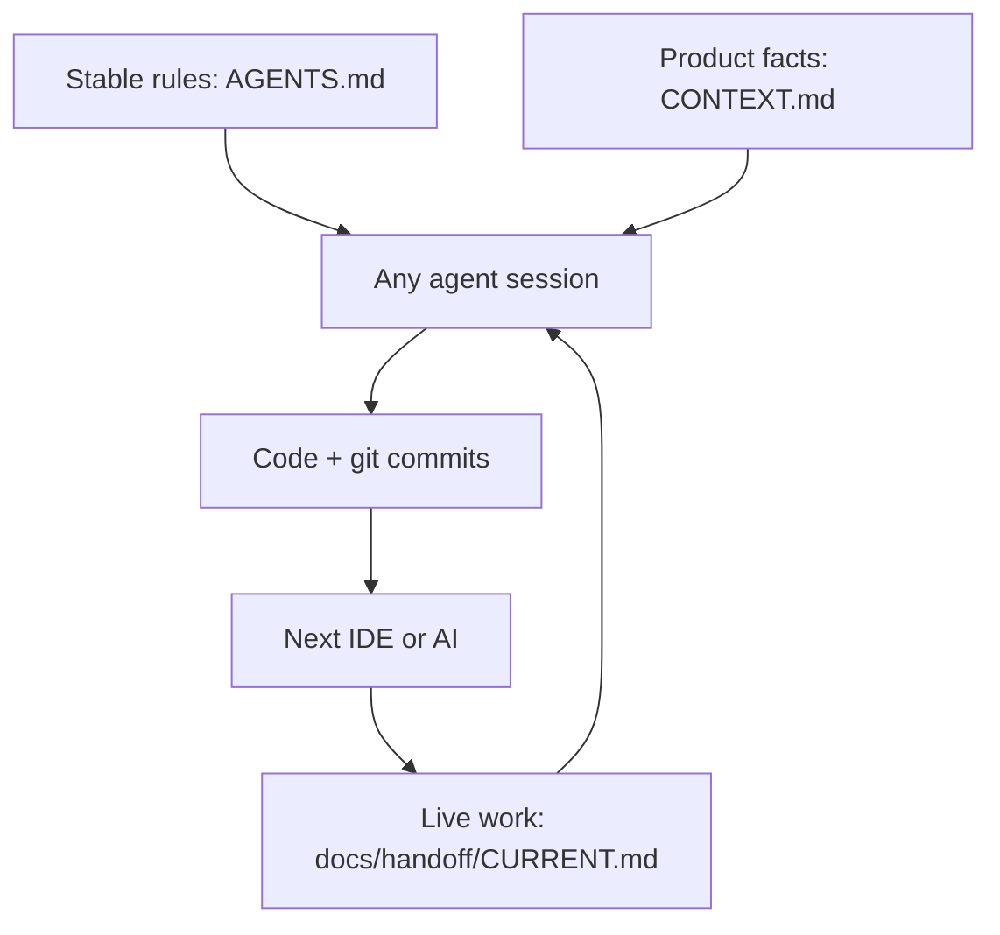

# Workflow: switch AI or IDE without losing context

## Why chat is not enough

Chat history stays inside one product (Cursor thread, Claude Code session, Copilot chat). The next tool cannot see it. **Git-tracked files are the continuity layer.**

## The three memory layers



1. **Stable** — how we work (`AGENTS.md`, skills, ADRs)
2. **Product** — what we are building (`CONTEXT.md`)
3. **Live** — what is in flight right now (`docs/handoff/CURRENT.md`)

## Switch procedure (5 minutes)

### Leaving a tool

1. Finish or park the current change in git (`git status` clean enough to resume).
2. Update `docs/handoff/CURRENT.md`:
   - Status: `in_progress` | `blocked` | `ready_for_review` | `done`
   - Done / Next / Open questions / Files / Commands
3. Commit: `docs(handoff): park work before switching tools`
4. Push the branch.

### Entering another tool

1. Open the **same repo + branch**.
2. Paste this starter prompt (or rely on AGENTS.md auto-load):

```text
Read AGENTS.md, CONTEXT.md, and docs/handoff/CURRENT.md.
Continue from the Next section. Do not redo completed work.
Ask only if a blocker is unclear.
```

3. Run the commands listed under **Commands to run** in the handoff.
4. Work, then update the handoff again before you leave.

## What never belongs only in chat

- Architecture decisions → `docs/adr/`
- Product glossary / constraints → `CONTEXT.md`
- “We decided to use X” → ADR or CONTEXT
- “Next you should…” → handoff **Next** list
- Reusable procedures → `.agents/skills/*/SKILL.md`

## Anti-patterns

- Dumping the whole wiki into AGENTS.md (keep it actionable)
- Maintaining separate long CLAUDE.md and AGENTS.md copies (they drift)
- Ending a session without updating the handoff
- Putting secrets in CONTEXT or handoff
